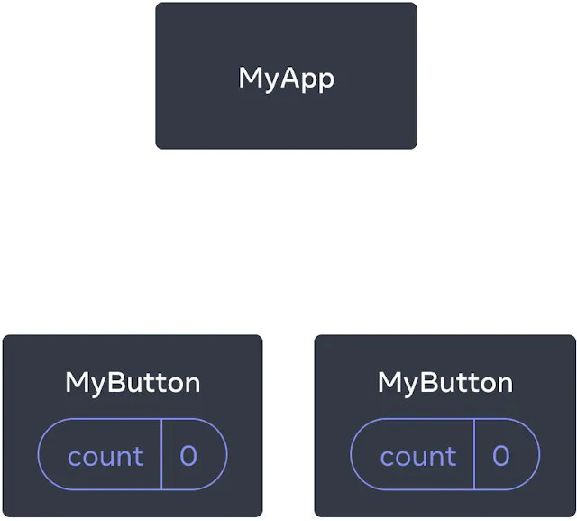
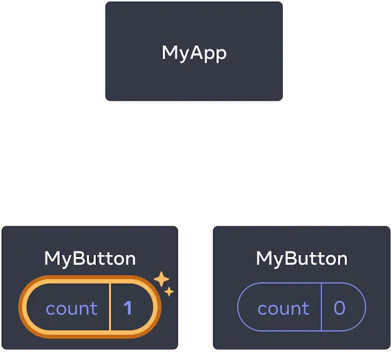

# React

## Démarrage rapide

Bienvenue dans la documentation React ! Dans cette page, vous allez découvrir les 80% de concepts React que vous utiliserez sans doute au quotidien.
Vous allez apprendre

    Comment créer et imbriquer des composants
    Comment ajouter du balisage et des styles
    Comment afficher des données
    Comment faire un rendu conditionnel et traiter des listes
    Comment réagir à des événements et mettre à jour l’affichage
    Comment partager des données entre composants

## Créer et imbriquer des composants

Les applis React sont constituées de composants. Un composant, c’est un bout d’UI (User Interface, donc interface utilisateur) avec son comportement et son apparence propres. Un composant peut être aussi petit qu’un bouton, ou aussi grand qu’une page entière.

## Les composants React sont des fonctions JavaScript qui renvoient du balisage :

```
function MyButton() {
return (
<button>Je suis un bouton</button>
);
}
```

## À présent que vous avez déclaré MyButton, vous pouvez l’imbriquer dans un autre composant :

```
export default function MyApp() {
return (
<div>
<h1>Bienvenue dans mon appli</h1>
<MyButton />
</div>
);
}
```

Remarquez que <MyButton /> commence par une majuscule. C’est comme ça que React sait qu’il s’agit d’un composant. Les noms de composants React doivent toujours démarrer par une majuscule, alors que les balises HTML doivent être en minuscules.

## Voyons ce que ça donne :

```
function MyButton() {
return (
<button>
Je suis un bouton
</button>
);
}

export default function MyApp() {
return (
<div>
<h1>Bienvenue dans mon appli</h1>
<MyButton />
</div>
);
}
```

Les mots-clés export default indiquent le composant principal du fichier. Si vous n’êtes pas habitué·e à certains éléments syntaxiques de JavaScript, le MDN et javascript.info sont d’excellentes références.

## Écrire du balisage avec JSX

La syntaxe de balisage que vous avez vue ci-avant s’appelle JSX. Elle n’est pas à proprement parler obligatoire, mais la plupart des projets React utilisent JSX par confort. Tous les outils que nous recommandons pour le développement en local prennent en charge JSX d’entrée de jeu.

JSX est plus exigeant que HTML. Vous devez fermer les balises telles que <br />. Par ailleurs, votre composant ne peut pas renvoyer plusieurs balises JSX. Il vous faudrait les enrober dans un parent commun, tel qu’un <div>...</div> ou un Fragment <>...</> vide :

```
function AboutPage() {
  return (
    <>
      <h1>À propos</h1>
      <p>Bien le bonjour.<br />Comment ça va ?</p>
    </>
  );
}
```

Si vous avez beaucoup de HTML à migrer vers du JSX, vous pouvez vous aider de https://transform.tools/html-to-jsx.

## Ajouter des styles

Dans React, vous précisez une classe CSS avec className. Ça fonctionne exactement comme l’attribut class en HTML :

```

```

Ensuite vous écrivez vos règles CSS dans un fichier CSS distinct :

```
/* Dans votre CSS */
.avatar {
  border-radius: 50%;
}
```

React n’impose aucune façon particulière de fournir des fichiers CSS. Le cas le plus simple consiste à utiliser une balise <link> dans votre HTML. Si vous utilisez un outil de build ou un framework, consultez sa documentation pour apprendre comment ajouter un fichier CSS à votre projet.

## Afficher des données

JSX vous permet de mettre du balisage dans du JavaScript. Les accolades servent à « ressortir » dans JavaScript afin d’injecter une variable ou expression dans votre code et de l’afficher à l’utilisateur. Par exemple, ce code affichera user.name :

```
return (
  <h1>
    {user.name}
  </h1>
);
```

Vous pouvez aussi « ressortir dans JavaScript » au sein d’attributs JSX, mais vous devrez utiliser des accolades à la place des guillemets. Par exemple, className="avatar" passe la chaîne "avatar" comme classe CSS, mais src={user.imageUrl} lit d’abord la valeur de l’expression JavaScript user.imageUrl, et ensuite passe cette valeur à l’attribut src :

```
return (
  
);
```

Vous pouvez utiliser des expressions plus complexes au sein des accolades JSX, par exemple de la concaténation de chaînes :

```
const user = {
  name: 'Hedy Lamarr',
  imageUrl: 'https://i.imgur.com/yXOvdOSs.jpg',
  imageSize: 90,
};

export default function Profile() {
  return (
    <>
      <h1>{user.name}</h1>
      
    </>
  );
}
```

Dans l’exemple ci-avant, style={{}} ne constitue pas une syntaxe spéciale : c’est un littéral objet {} au sein d’accolades JSX style={}. Vous pouvez utiliser l’attribut style lorsque vos styles dépendent de données dans votre code JavaScript.

## Affichage conditionnel

Dans React, il n’y a pas de syntaxe spéciale pour écrire des conditions. Au lieu de ça, on utilise les mêmes techniques que pour écrire du code JavaScript normal. Par exemple, vous pouvez utiliser une instruction if pour choisir quel bout de JSX inclure :

```
let content;
if (isLoggedIn) {
  content = <AdminPanel />;
} else {
  content = <LoginForm />;
}
return (
  <div>
    {content}
  </div>
);
```

Si vous préférez un style plus compact, vous pouvez utiliser l’opérateur ternaire conditionnel ?. Contrairement à if, celui-ci marche aussi au sein-même de JSX :

```
<div>
  {isLoggedIn ? (
    <AdminPanel />
  ) : (
    <LoginForm />
  )}
</div>
```

Si vous n’avez pas besoin de la branche else, vous pouvez utiliser l’opérateur && logique, plus court :

```
<div>
  {isLoggedIn && <AdminPanel />}
</div>
```

Toutes ces façons de faire fonctionnent aussi pour la définition conditionnelle d’attributs. Si certaines de ces syntaxes vous déroutent, vous pouvez toujours commencer par if...else.

## Afficher des listes

Pour afficher des listes de composants vous utiliserez principalement la méthode map() des tableaux, et parfois des boucles for.

Par exemple, disons que vous avez un tableau de produits :

```
const products = [
  { title: 'Chou', id: 1 },
  { title: 'Ail', id: 2 },
  { title: 'Pomme', id: 3 },
];
```

Dans ce composant, on utilise la méthode map() pour transformer un tableau de produits en tableau d’éléments <li> :

```
const listItems = products.map(product =>
  <li key={product.id}>
    {product.title}
  </li>
);

return (
  <ul>{listItems}</ul>
);
```

Notez comment a un attribut. Pour chaque élément d’une liste, vous devez transmettre une chaîne ou un nombre qui identifie de manière unique cet élément parmi ses frères et sœurs. Habituellement, une clé doit provenir de vos données, comme un ID de base de données. React utilise vos clés pour savoir ce qui s’est passé si vous insérez, supprimez ou réorganisez ultérieurement les éléments.<li>key

```
const products = [
  { title: 'Cabbage', isFruit: false, id: 1 },
  { title: 'Garlic', isFruit: false, id: 2 },
  { title: 'Apple', isFruit: true, id: 3 },
];

export default function ShoppingList() {
  const listItems = products.map(product =>
    <li
      key={product.id}
      style={{
        color: product.isFruit ? 'magenta' : 'darkgreen'
      }}
    >
      {product.title}
    </li>
  );

  return (
    <ul>{listItems}</ul>
  );
}

```

## Réagir aux événements

Vous pouvez répondre aux événements en déclarant des fonctions de gestionnaire d’événements à l’intérieur de vos composants :

```
function MyButton() {
  function handleClick() {
    alert('You clicked me!');
  }

  return (
    <button onClick={handleClick}>
      Click me
    </button>
  );
}
```

Remarquez qu’il n’y a pas de parenthèses à la fin ! N’appelez pas la fonction de gestionnaire d’événements : vous devez seulement la transmettre. React appellera votre gestionnaire d’événements lorsque l’utilisateur cliquera sur le bouton.onClick={handleClick}

## Mise à jour de l’écran

Souvent, vous voudrez que votre composant « se souvienne » de certaines informations et les affiche. Par exemple, vous souhaitez peut-être compter le nombre de fois qu’un bouton est cliqué. Pour ce faire, ajoutez state à votre composant.

Tout d’abord, importez useState depuis React :

```
import { useState } from 'react';
```

Vous pouvez maintenant déclarer une variable d’état à l’intérieur de votre composant :

```
function MyButton() {
  const [count, setCount] = useState(0);
  // ...
```

Vous obtiendrez deux choses à partir de : l’état actuel (), et la fonction qui vous permet de le mettre à jour (). Vous pouvez leur donner n’importe quel nom, mais la convention est d’écrire .useStatecountsetCount[something, setSomething]

La première fois que le bouton s’affiche, c’est parce que vous avez passé à . Lorsque vous souhaitez changer d’état, appelez-le et passez-lui la nouvelle valeur. En cliquant sur ce bouton, le compteur sera incrémenté :count00useState()setCount()

```
function MyButton() {
  const [count, setCount] = useState(0);

  function handleClick() {
    setCount(count + 1);
  }

  return (
    <button onClick={handleClick}>
      Clicked {count} times
    </button>
  );
}
```

React appellera à nouveau la fonction de votre composant. Cette fois, ce sera . Ensuite, ce sera . Et ainsi de suite.count12

Si vous rendez le même composant plusieurs fois, chacun aura son propre état. Cliquez sur chaque bouton séparément :

```
import { useState } from 'react';

export default function MyApp() {
  return (
    <div>
      <h1>Counters that update separately</h1>
      <MyButton />
      <MyButton />
    </div>
  );
}

function MyButton() {
  const [count, setCount] = useState(0);

  function handleClick() {
    setCount(count + 1);
  }

  return (
    <button onClick={handleClick}>
      Clicked {count} times
    </button>
  );
}
```

Remarquez comment chaque bouton « se souvient » de son propre état et n’affecte pas les autres boutons.count

## Utilisation des crochets

Les fonctions commençant par sont appelées Hooks. est un Hook intégré fourni par React. Vous pouvez trouver d’autres hooks intégrés dans la référence de l’API. Vous pouvez également écrire vos propres Hooks en combinant ceux existants.useuseState

Les crochets sont plus restrictifs que les autres fonctions. Vous ne pouvez appeler des Hooks qu’en haut de vos composants (ou d’autres Hooks). Si vous souhaitez l’utiliser dans une condition ou une boucle, extrayez un nouveau composant et placez-le là.useState

## Partage de données entre composants

Dans l’exemple précédent, chacun avait son propre , et lorsque chaque bouton était cliqué, seul le pour le bouton cliqué changeait :MyButtoncountcount




Cependant, vous aurez souvent besoin de composants pour partager les données et toujours les mettre à jour ensemble.

Pour que les deux composants s’affichent de la même manière et se mettent à jour ensemble, vous devez déplacer l’état des boutons individuels « vers le haut » vers le composant le plus proche qui les contient tous.MyButtoncount

Dans cet exemple, il s’agit de :MyApp


# my-app-react
